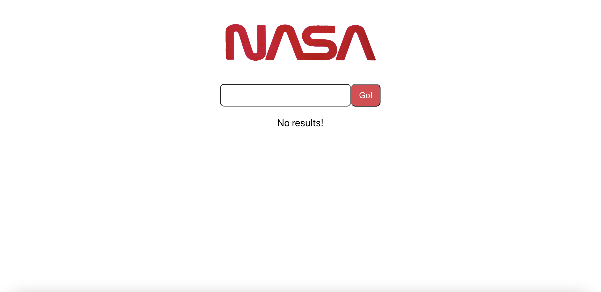
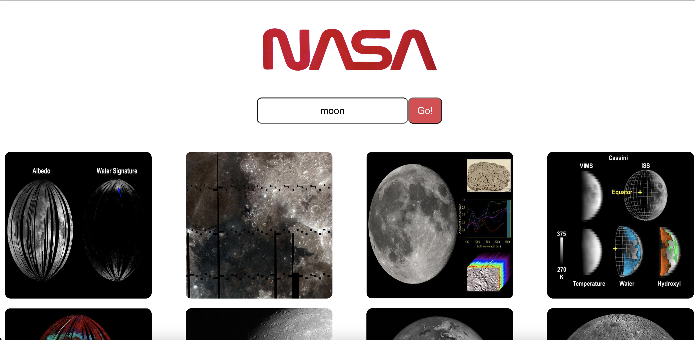

# React Technical Test - Image Search
This is an app built with React (create-react-app), Node.js, and Axios to search for images based on an external NASA API provided https://images-api.nasa.gov/search?q=moon. For testing utilities, Jest and React Testing Library was used.

Users should be able to
    *Search images by keyword
    *Images must be returned upon a successful search

# Example

# Installation
* Create a fork of this repo.
* Copy the fork's git address https://github.com/david-tech-ding/tech-test and clone it to your machine with <code>git clone</code>.
* Install all necessary dependencies with <code>npm install</code>.
* Install axios with <code>npm install axios</code>
* Use <code>npm test</code> to run tests.
* Use <code>npm start</code> to run the application in your local browser.

# How to use
* The app will initially have no results shown as nothing has been searched.
* Type a keyword to retrieve the desired images.
* For example, if you search for moon and press 'Enter' on your keyboard or press the 'Go!' button, images related to moons will be retrieved.

# What I would do if I had more time
* Allowing users to search for other space-related queries other than moon images
* Improve error handling and validation by implementing appropriate error messages, validating user inputs, and handling edge cases to help improve user experience
* Implementing database migrations to manage schema changes to make it easier to update and deploy the application.

# Credits
David Ding:
https://github.com/david-tech-ding
https://www.linkedin.com/in/txding/
